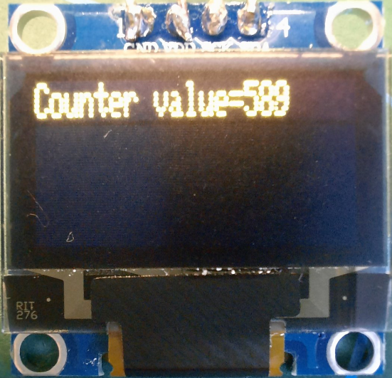

# 23D_OLEDisplay_test
Testing nBlocksStudio Schematic Design c++ project for the Node [OLEDisplay](https://github.com/nBlocksStudioNodes/nblocks_oledisplay) and the [Schematic Design 23D](https://github.com/nBlocksStudioApps/23D_OLEDisplay_test)

## The Schematic Design
Project 23D Schematic  :heavy_check_mark:
 

## nBlocksStudio Translation
Translation from Schematic Design to c++ project  :heavy_check_mark:

## Compilation
Compilation and build for LPC1768 complete  :heavy_check_mark:

## Display
The Display works as expected :heavy_check_mark:
  
   

----

